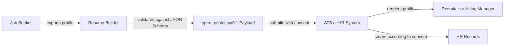

# Open Rooster CV Protocol v0.1

## Status
This is a draft conceptual specification for an open, vendor-neutral JSON protocol for resume and CV exchange. It is intentionally small enough for resume builders, job boards, applicant tracking systems, and employer HR systems to implement without replacing their existing workflows.

The protocol name for this draft is `open.rooster.cv/0.1`.

## Purpose
The protocol replaces brittle PDF and Word parsing with structured career data supplied directly by the job seeker or an authorized profile system. A conforming payload can be validated as JSON, rendered for human review, and imported into HR systems without guessing which text represents employers, dates, credentials, skills, or consent terms.

The protocol is not a hiring decision model, scoring model, or candidate ranking standard. It defines data exchange only.

## Non-Goals
- It does not require employers to stop accepting PDF, DOCX, or accessible HTML resumes.
- It does not define a universal skill taxonomy in v0.1.
- It does not make applicant-provided claims automatically trusted.
- It does not require digital signatures or verifiable credentials.
- It does not define a complete submission API in v0.1.
- It does not include demographic, disability, veteran, equal opportunity, or background-check data in the base profile.

## Required Envelope
Every v0.1 payload is a JSON object with these top-level sections:

```json
{
  "protocol": {
    "name": "open.rooster.cv",
    "version": "0.1"
  },
  "profile": {},
  "application": {},
  "consent": {},
  "metadata": {}
}
```

The top-level sections have distinct responsibilities:
- `protocol` identifies the protocol, version, and optional extensions used by the payload.
- `profile` contains reusable career information controlled by the job seeker.
- `application` contains job-specific submission information.
- `consent` describes how the recipient may use and retain the submitted data.
- `metadata` records creation time, language, source system, schema location, and optional integrity information.

## Minimal v0.1 Scope
The v0.1 profile model supports the fields needed by most resumes:
- Identity and contact information.
- Professional summary and headline.
- Work experience.
- Education.
- Skills.
- Certifications and licenses.
- Projects and portfolio links.
- Human languages.
- Job preferences.

Academic CV, regulated-profession, government, immigration, references, background check, demographic, and equal opportunity data belong in optional extensions or separate downstream workflows.

## Required Fields
A v0.1 payload must include:
- `protocol.name`
- `protocol.version`
- `profile.id`
- `profile.identity.displayName`
- At least one contact method in `profile.identity.contact`
- `consent.purpose`
- `consent.scope`
- `metadata.createdAt`
- `metadata.language`

Work experience, education, skills, certifications, projects, and preferences are optional because real applicants may be students, career changers, contractors, caregivers returning to work, or people with nontraditional experience.

## Identifiers
The `profile.id` field identifies the profile within the source system. It should not be a government identifier, tax identifier, national insurance number, passport number, or other sensitive legal identifier.

Recommended forms:
- A UUID generated by the profile tool.
- A decentralized identifier.
- A stable opaque identifier controlled by the profile provider.

## Dates
Use ISO 8601 date strings:
- Full dates use `YYYY-MM-DD`.
- Month-level resume dates use `YYYY-MM`.
- Open-ended roles set `endDate` to `null` and `current` to `true`.

Approximate dates should be represented using the least precise valid form rather than invented exact dates.

## Locations
The base protocol supports location granularity without requiring a street address:

```json
{
  "city": "Austin",
  "region": "TX",
  "country": "US",
  "remote": true
}
```

Street addresses should not be included in the base profile unless a jurisdiction or role requires them. Job seekers should be able to share country, region, or city-level location only.

## Profile Sections

### Identity
`profile.identity` describes how the applicant wants to be known and contacted for the application. It supports:
- `displayName`
- `givenName`
- `familyName`
- `pronunciation`
- `contact`
- `location`
- `links`

Contact methods may include email, phone, website, portfolio, or professional network links.

### Summary
`profile.summary` contains a short career summary, headline, and optional role objective. This content is applicant-authored and should not be treated as verified evidence.

### Work Experience
`profile.work` is an array of roles. Each role may include:
- Employer name.
- Role title.
- Employment type.
- Location.
- Start and end dates.
- Responsibilities.
- Achievements.
- Skills used.
- Provenance.

Achievements should be modeled separately from responsibilities so systems can render them distinctly and reviewers can understand impact.

### Education
`profile.education` is an array of education records. Each record may include:
- Institution.
- Credential or degree.
- Field of study.
- Start and end dates.
- Honors.
- Coursework.
- Verification link or credential reference.
- Provenance.

### Skills
`profile.skills` is an array of applicant-supplied skills. Each skill may include:
- Name.
- Category.
- Proficiency signal.
- Years of experience.
- Last used date.
- Evidence references.
- Provenance.

The protocol does not prescribe a universal taxonomy in v0.1. Implementers may map skill names to internal taxonomies, but mapped values should be marked as derived data.

### Certifications And Licenses
`profile.credentials` includes certifications, licenses, clearances, and similar credentials. Each credential may include issuer, credential ID, issue date, expiry date, verification URL, and provenance.

Sensitive credentials, such as security clearances or immigration documents, should be represented through explicit extensions with stronger access controls.

### Projects
`profile.projects` contains professional, academic, open-source, volunteer, or portfolio projects. Each project may include title, role, description, outcomes, dates, links, and skills used.

### Languages
`profile.languages` contains human languages and proficiency levels. Implementers should distinguish human language proficiency from programming languages, which belong in `profile.skills`.

### Preferences
`profile.preferences` captures optional job-seeker preferences such as desired role types, preferred locations, remote or hybrid preference, travel willingness, and availability. Compensation expectations are optional and should only be requested or shared where legally appropriate.

## Application Section
The reusable `profile` should be separated from the job-specific `application`.

The `application` section may include:
- Employer name.
- Job requisition ID.
- Job title.
- Application date.
- Tailored summary or cover statement.
- Availability.
- Work authorization answers.
- Screening question answers.
- Applicant attestations.
- Rendered resume URL.

Screening answers should keep the original employer question text or stable question ID, because interpretation can vary between employers.

## Consent Section
The `consent` object must describe:
- `purpose`: the intended use, such as `job_application`.
- `scope`: the sections shared in this payload.
- `grantedAt`: when consent was granted.
- `retention`: requested retention treatment.
- `revocation`: optional instructions for revoking consent.

Example:

```json
{
  "purpose": "job_application",
  "scope": ["profile.identity", "profile.work", "profile.education", "profile.skills"],
  "grantedAt": "2026-05-28T18:40:00Z",
  "retention": {
    "policy": "until_hiring_decision",
    "deleteAfter": "2026-11-28"
  }
}
```

Consent fields are not a substitute for legal compliance. They provide a machine-readable expression of applicant intent and system behavior.

## Privacy Boundaries
The base v0.1 profile should not contain:
- Government identifiers.
- Birth date or age.
- Full residential address.
- Marital or family status.
- Race, ethnicity, religion, disability, veteran status, gender identity, or sexual orientation.
- Salary history.
- Reference contact details.
- Background-check information.
- Immigration document numbers.
- Medical or health information.

If an employer requires sensitive data for lawful reasons, it should be collected through a separate compliance extension or system flow with explicit purpose and consent.

## Provenance
Any major claim may include a `provenance` object:

```json
{
  "source": "applicant",
  "verifiedBy": "credential_issuer",
  "verificationUrl": "https://example.edu/verify/credential/123",
  "lastVerifiedAt": "2026-05-28T00:00:00Z"
}
```

Allowed v0.1 source values:
- `applicant`
- `issuer`
- `employer`
- `platform`
- `inferred`

The `inferred` source value must be used when a platform normalizes, enriches, or derives data that the applicant did not explicitly provide.

## Extensions
Extensions are namespaced under `protocol.extensions` and `extensions`.

Example:

```json
{
  "protocol": {
    "name": "open.rooster.cv",
    "version": "0.1",
    "extensions": ["academic.cv/0.1"]
  },
  "extensions": {
    "academic.cv/0.1": {
      "publications": []
    }
  }
}
```

Extension names should include a domain-like namespace and version. Extensions must not redefine the meaning of base fields.

## Rendering Contract
Conforming systems should be able to render the JSON payload into accessible HTML, PDF, or plain text. Rendering should preserve the factual content of the JSON and avoid hiding, inventing, or reordering claims in ways that change meaning.

The rendered view should identify applicant-provided, inferred, and verified claims when that distinction is available.

## Compatibility
Consumers should reject payloads with unsupported major versions. For v0.x drafts, consumers should validate against the declared schema and provide clear errors for unsupported extensions.

Implementers may ignore unknown optional fields if they preserve the original payload for audit and applicant access.

## Example Flow


