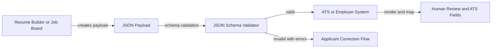

# Implementer Guide

This guide explains how applicant tracking systems, job boards, resume builders, employers, and job seekers can adopt `open.rooster.cv/0.1` without requiring a complete rewrite of current hiring workflows.

## For Applicant Tracking Systems
ATS platforms should accept the JSON payload alongside existing file uploads. The first useful integration is an import endpoint or upload control that validates the payload, stores the original JSON, and maps known fields into the ATS candidate profile.

Recommended behavior:
- Validate the payload against `schema/open-rooster-cv-v0.1.schema.json`.
- Preserve the original payload for audit, correction, and reprocessing.
- Render a human-readable resume view for recruiters and hiring managers.
- Mark applicant-provided, inferred, and verified data distinctly when provenance is available.
- Treat unknown extensions as optional data unless the employer explicitly requires them.
- Avoid writing inferred enrichments back into applicant-provided fields.

ATS systems should not fail an otherwise valid application because optional sections are absent. A student, career changer, contractor, or returning caregiver may have sparse work history but still provide a valid profile.

## For Employers And HR Departments
Employers can adopt the protocol gradually by allowing structured JSON uploads next to PDF and DOCX resumes. Recruiters can continue reviewing rendered resumes while HR systems receive reliable structured data for routing, compliance review, and reporting.

Recommended policy decisions:
- Decide which profile sections are required for each role family.
- Publish which screening questions appear in `application.screeningAnswers`.
- Define retention handling for `consent.retention`.
- Decide whether salary expectation fields are allowed in each jurisdiction.
- Keep demographic, equal opportunity, background-check, and reference workflows separate from the base profile.

Employers should provide clear applicant-facing explanations for how structured resume data will be used, who can see it, and how correction or deletion requests work.

## For Job Boards
Job boards can use the protocol as a portable profile export and application handoff format. A job board may maintain a richer internal candidate profile, then export only the sections the applicant approves for a specific employer.

Recommended behavior:
- Let applicants preview the exact JSON sections being shared.
- Support section-level sharing through `consent.scope`.
- Send employer-specific data in `application`, not by mutating the reusable `profile`.
- Preserve the applicant's original wording where possible.
- Label normalized skills, occupations, and locations as derived or inferred if they are not directly applicant-authored.

Job boards should avoid making a profile appear verified unless the data came from a credential issuer, prior employer, or equivalent trusted source.

## For Resume Builders
Resume builders are the easiest first adoption point because they already collect structured data before rendering a PDF. A builder can export `open.rooster.cv/0.1` directly and optionally render the same data into HTML, PDF, or plain text.

Recommended behavior:
- Store resume sections in schema-compatible structures.
- Validate before export.
- Explain privacy-sensitive fields and exclude them from the base profile by default.
- Support multiple application payloads from one reusable profile.
- Provide accessible rendered output that matches the structured content.

Builders should not invent exact dates when the applicant provides only a month or year. Use the least precise valid date form.

## For Job Seekers
Job seekers should be able to own, inspect, export, and reuse their structured profile. The protocol should make it clear what data is reusable career history and what data is specific to one job application.

Practical guidance:
- Share only the sections needed for a role.
- Keep sensitive personal information out of the base profile.
- Review `application.screeningAnswers` before submission.
- Use `consent.scope` and `consent.retention` to express intended use and retention.
- Prefer verified credential links when available, but do not rely on them for basic application submission.

## Validation Workflow
A typical validation workflow:

Validation should check:
- Required envelope sections.
- Required identity and contact fields.
- Valid date formats.
- Valid country and language codes where supplied.
- Consent purpose and scope.
- Unsupported extensions that the receiving system cannot process.

Validation errors should be written for applicants and implementers, not only engineers. For example, prefer “Work experience start date must be YYYY or YYYY-MM” over “pattern mismatch.”

## Rendering Guidance
Rendering systems should produce accessible human-readable output from the JSON payload. A rendered resume may be HTML, PDF, plain text, or an ATS-native profile view.

Rendered output should:
- Preserve applicant-authored wording.
- Show work history, education, skills, credentials, projects, and languages in a readable order.
- Avoid hiding provenance indicators when they matter.
- Avoid inserting derived skills or inferred claims into the applicant's narrative.
- Respect consent scope by rendering only shared sections.

The rendered document is a view of the structured payload, not the canonical source.

## Mapping Guidance
Most existing HR systems have their own candidate, job, and application models. Implementers should map fields conservatively:
- `profile.identity.displayName` maps to candidate name.
- `profile.identity.contact` maps to candidate contact methods.
- `profile.work` maps to experience or employment history.
- `profile.education` maps to education history.
- `profile.skills` maps to candidate skills.
- `profile.credentials` maps to certifications and licenses.
- `application.jobRequisitionId` maps to requisition or job ID.
- `application.screeningAnswers` maps to the application questionnaire.
- `consent` maps to privacy, retention, and audit metadata.

When a destination field is less expressive than the protocol field, preserve the full JSON payload so data is not lost.

## Security And Privacy
Implementers should treat resume JSON as personal data. At minimum:
- Use encrypted transport for submissions.
- Apply access controls equivalent to or stronger than current resume storage.
- Log access to payloads and rendered views.
- Avoid storing unnecessary sensitive data.
- Separate base profile data from compliance, background-check, and demographic workflows.
- Respect deletion, correction, and retention requests when legally possible.

Optional signatures, hashes, and verifiable credentials can improve integrity and trust, but they are not required for v0.1 adoption.

## Extension Handling
Extensions allow the base protocol to stay small. A consumer should:
- Check `protocol.extensions`.
- Process supported extensions.
- Preserve unsupported extensions if policy allows.
- Warn the applicant or sender when a required employer extension is unsupported.
- Never reinterpret extension fields as base fields unless the extension specification defines that mapping.

Suggested early extensions:
- `academic.cv/0.1` for publications, grants, teaching, appointments, and service.
- `healthcare.licenses/0.1` for regulated clinical licenses.
- `portfolio.creative/0.1` for media, credits, exhibitions, and reels.
- `public-sector/0.1` for civil service or government-specific application data.

## Adoption Phases
Phase 1: Accept and validate JSON uploads next to PDF and DOCX.

Phase 2: Render JSON payloads into recruiter-friendly profile views and map core fields into ATS records.

Phase 3: Add section-level applicant controls, correction flows, and consent-aware retention handling.

Phase 4: Add optional verified credentials, signatures, and industry-specific extensions.

Phase 5: Publish employer and vendor conformance tests so integrations can be certified.
